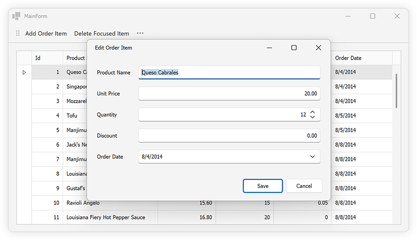

<!-- default badges list -->
[](https://supportcenter.devexpress.com/ticket/details/T1253821)
[](https://docs.devexpress.com/GeneralInformation/403183)
[](#does-this-example-address-your-development-requirementsobjectives)
<!-- default badges end -->
# Connect the DevExpress WinForms Data Grid to a .NET Core Service and Enable Data Editing

> **NOTE**
> This example extends the capabilities (introduces data editing support when using the WinForms Data Grid through accessible endpoints) of the following example: [Connect the DevExpress WinForms Data Grid to a .NET Core Service](https://github.com/DevExpress-Examples/connect-winforms-grid-to-dotnetcore-service). This example implements a REST-style access pattern.
>
> Review the following step-by-step tutorial to run the example: [Getting Started](https://github.com/DevExpress-Examples/connect-winforms-grid-to-dotnetcore-service?tab=readme-ov-file#getting-started).

## POST, PUT, and DELETE Endpoints

 The ASP.NET Core `MapPost`, `MapPut`, and `MapDelete` methods manage different HTTP methods when processing incoming requests.

* `MapPost`: Manages HTTP POST requests, generally used to create new data.
* `MapPut`: Processes HTTP PUT requests, used to update existing data.
* `MapDelete`: Manages HTTP DELETE requests, used to remove records. 

 ```csharp
 app.MapPost("/data/OrderItem", async (DataServiceDbContext dbContext, OrderItem orderItem) => {
    dbContext.OrderItems.Add(orderItem);
    await dbContext.SaveChangesAsync();
    return Results.Created($"/data/OrderItem/{orderItem.Id}", orderItem);
});

app.MapPut("/data/OrderItem/{id}", async (DataServiceDbContext dbContext, int id, OrderItem orderItem) => {
    if (id != orderItem.Id) {
        return Results.BadRequest("Id mismatch");
    }

    dbContext.Entry(orderItem).State = EntityState.Modified;
    await dbContext.SaveChangesAsync();
    return Results.NoContent();
});

app.MapDelete("/data/OrderItem/{id}", async (DataServiceDbContext dbContext, int id) => {
    var orderItem = await dbContext.OrderItems.FindAsync(id);

    if (orderItem is null) {
        return Results.NotFound();
    }

    dbContext.OrderItems.Remove(orderItem);
    await dbContext.SaveChangesAsync();
    return Results.NoContent();
});
 ```

## Data Editing Form

This example includes a standalone data editing form. The edit form is used to modify existing data rows and add new rows.



The example uses the DevExpress WinForms Form Layout component to automatically arrange DevExpress Data Editors and eliminate the hassles associated with pixel-based form design.

## DataServiceClient

The `DataServiceClient` class is an abstraction designed to simplify data service interactions (by encapsulating common HTTP operations).

## Fetch Data

The following code in *VirtualServerModeDataLoader.cs* calls the `DataServiceClient.GetOrderItemsAsync` method to fetch data. The `GetOrderItemsAsync` method fetches a list of order items by specifying row counts, batch sizes, and sorting parameters:

```csharp
public Task<VirtualServerModeRowsTaskResult> GetRowsAsync(VirtualServerModeRowsEventArgs e) {
    return Task.Run(async () => {
        Debug.WriteLine($"Fetching data rows {e.CurrentRowCount} to {e.CurrentRowCount + BatchSize}, sorting by {SortField} ({(SortAscending ? "asc" : "desc")})");
        var dataFetchResult = await DataServiceClient.GetOrderItemsAsync(e.CurrentRowCount, BatchSize, SortField, SortAscending);

        if (dataFetchResult is null)
            return new VirtualServerModeRowsTaskResult();

        var moreRowsAvailable = e.CurrentRowCount + dataFetchResult.Items.Count < dataFetchResult.TotalCount;
        Debug.WriteLine($"Returning {dataFetchResult.Items.Count} items, more rows available: {moreRowsAvailable}");
        return new VirtualServerModeRowsTaskResult(dataFetchResult.Items, moreRowsAvailable);
    }, e.CancellationToken);
}
```

## Update Data

The `DataServiceClient.UpdateOrderItemAsync` method encodes the transfer object as JSON and sends it to the service URL using a PUT request. The `UpdateOrderItemAsync` method invokes `EnsureSuccessStatusCode()` after the PUT request to ensure the object is successfully updated.

```csharp
public static async Task UpdateOrderItemAsync(OrderItem orderItem) {
    using var client = CreateClient();
    var response = await client.PutAsync($"{baseUrl}/data/OrderItem/{orderItem.Id}",
        new StringContent(JsonSerializer.Serialize(orderItem), Encoding.UTF8, "application/json"));
    response.EnsureSuccessStatusCode();
}
```

The edit form is displayed when a user double-clicks a data row:

```csharp
async void gridView1_DoubleClick(object sender, EventArgs e) {
    if (sender is GridView view) {
        if (view.FocusedRowObject is OrderItem oi) {
            var editResult = EditForm.EditItem(oi);
            if (editResult.changesSaved) {
                await DataServiceClient.UpdateOrderItemAsync(editResult.item);
                view.RefreshData();
            }
        }
    }
}
```

## Create New Item

The `DataServiceClient.CreateOrderItemAsync` method creates a new `OrderItem`. The `CreateOrderItemAsync` method serializes the object, sends it to the service, and deserializes the response back into an `OrderItem`. This pattern supports server-generated values, such as auto-incremented keys.

```csharp
public static async Task<OrderItem?> CreateOrderItemAsync(OrderItem orderItem) {
    using var client = CreateClient();
    var response = await client.PostAsync($"{baseUrl}/data/OrderItem",
        new StringContent(JsonSerializer.Serialize(orderItem), Encoding.UTF8, "application/json"));
    response.EnsureSuccessStatusCode();
    var responseBody = await response.Content.ReadAsStringAsync();
    return responseBody.AsOrderItem();
}

static OrderItem? AsOrderItem(this string responseBody) {
    return JsonSerializer.Deserialize<OrderItem>(responseBody, new JsonSerializerOptions {
        PropertyNameCaseInsensitive = true
    });
}
```

To add a new data row, click the "Add Order Item" item within the toolbar.

```csharp
async void addItemButton_ItemClick(object sender, DevExpress.XtraBars.ItemClickEventArgs e) {
    if (gridControl.FocusedView is ColumnView view) {
        var createResult = EditForm.CreateItem();
        if (createResult.changesSaved) {
            await DataServiceClient.CreateOrderItemAsync(createResult.item!);
            view.RefreshData();
        }
    }
}
```

## Delete Item

The `DataServiceClient.DeleteOrderItemAsync` method catches any exceptions and returns a Boolean value to indicate success or failure. The `DeleteOrderItemAsync` method logs errors using `Debug.WriteLine()` and returns **false** if an error occurs (allowing the UI or business logic to respond appropriately).

```csharp
public static async Task<bool> DeleteOrderItemAsync(int id) {
    try {
        using var client = CreateClient();
        var response = await client.DeleteAsync($"{baseUrl}/data/OrderItem/{id}");
        response.EnsureSuccessStatusCode();
        return true;
    }
    catch (Exception ex) {
        Debug.WriteLine(ex);
        return false;
    }
}
```

To delete the focused data row, click the "Delete Focused Item" item within the toolbar.

```csharp
async void deleteItemButton_ItemClick(object sender, DevExpress.XtraBars.ItemClickEventArgs e) {
    if (gridControl.FocusedView is ColumnView view &&
        view.GetFocusedRow() is OrderItem orderItem) {
        await DataServiceClient.DeleteOrderItemAsync(orderItem.Id);
        view.RefreshData();
    }
}
```

## Files to Review

* [Program.cs](./CS/DataService/Program.cs)
* [EditForm.cs](./CS/WinForms.Client/EditForm.cs)
* [MainForm.cs](./CS/WinForms.Client/MainForm.cs)
* [DataServiceClient.cs](./CS/WinForms.Client/DataServiceClient.cs)

## See Also

* [Connect a WinForms Data Grid to an Arbitrary ASP.NET Core WebAPI Service Powered by EF Core — Architecture and Data Binding (Part 1)](https://community.devexpress.com/blogs/news/archive/2024/08/30/connect-a-winforms-data-grid-to-a-net-core-service.aspx)
* [Connect a WinForms Data Grid to an Arbitrary ASP.NET Core WebAPI Service Powered by EF Core — Add Editing Features (Part 2)](https://community.devexpress.com/blogs/news/archive/2024/09/06/connect-a-winforms-data-grid-to-an-arbitrary-asp-net-core-webapi-service-powered-by-ef-core-add-editing-features.aspx)

<!-- feedback -->
## Does this example address your development requirements/objectives?

[](https://www.devexpress.com/support/examples/survey.xml?utm_source=github&utm_campaign=connect-winforms-grid-to-dotnetcore-service-enable-editing&~~~was_helpful=yes) [](https://www.devexpress.com/support/examples/survey.xml?utm_source=github&utm_campaign=connect-winforms-grid-to-dotnetcore-service-enable-editing&~~~was_helpful=no)

(you will be redirected to DevExpress.com to submit your response)
<!-- feedback end -->
